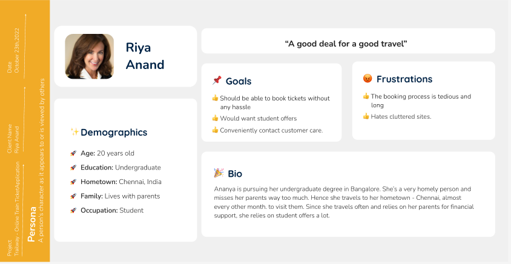
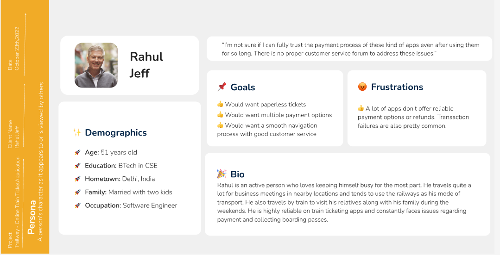
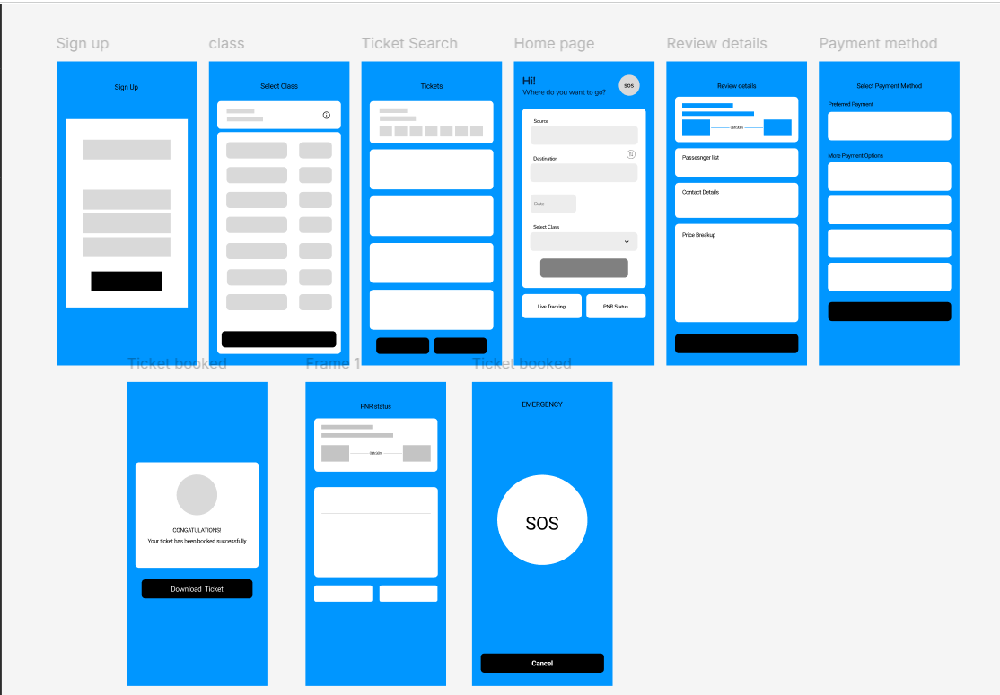

# 🚆 Trailway – Online Train Ticket Booking UI/UX

A user-centered mobile train ticket booking application prototype designed in **Figma**, focused on simplifying the booking experience while improving accessibility, navigation and usability.

This academic project follows a **User-Centered Design (UCD)** approach, progressing from user research and problem identification to personas, task flows, wireframes, prototyping, usability testing and iterative design improvements.

---

## 📌 Project Overview

Train ticket booking applications can sometimes involve complex navigation, cluttered interfaces and accessibility challenges.

**Trailway** was designed to explore a simpler and more user-friendly train ticket booking experience.

The project considered features such as:

- Train search by source and destination
- Ticket booking and confirmation
- Ticket status
- Multiple payment options
- Ticket download
- Voice assistance
- Nearby station search
- Live train tracking
- Seat status
- SOS functionality
- Accessibility settings
- Display and text-size options

> **Note:** Trailway is a UI/UX prototype created for an academic usability-design project. The screens and interactions demonstrate the proposed user experience and should not be interpreted as a deployed production application.

---

## 🎯 Project Objective

The objective of Trailway was to study the usability of train ticket booking applications and design an improved experience that makes common booking activities easier for users.

The project focused particularly on:

- Simplifying navigation
- Reducing interface clutter
- Improving accessibility
- Making the booking flow easier to understand
- Supporting safety-related functionality
- Improving the overall user experience

---

## 🔄 User-Centered Design Process

The project followed a user-centered design lifecycle:

```text
Discovery
   ↓
Define
   ↓
Design
   ↓
Prototype
   ↓
Usability Testing
   ↓
Iteration
   ↓
Final Design
```

The process helped move from identifying user problems to designing and evaluating an improved interface.

---

## 🔎 Discovery & User Research

During the discovery stage, user problems and expectations around train ticket booking were explored.

Some of the identified pain points included:

- Time-consuming booking processes
- Refund-related difficulties
- Difficulty selecting preferred seating
- Complex or cluttered interfaces
- Accessibility limitations

These observations were used to guide the subsequent design decisions.

---

## 👥 User Personas

Personas were used to understand different types of travelers, their goals, expectations and frustrations.

### Persona 1



### Persona 2



The personas helped keep the design focused on users rather than only on application functionality.

---

## 🧩 Problem Definition

After the discovery stage, the identified user problems were translated into design requirements.

The project explored how a train booking application could provide:

- Clearer navigation
- A more understandable booking process
- Better accessibility
- Easier access to important travel information
- Improved safety-related options
- A less cluttered interface

---

## 🗺️ Task Flow

A task flow was developed to understand how users would navigate through the application and complete key activities.


This helped establish the logical sequence of screens before progressing to detailed interface design.

---

## ✏️ Wireframing

Initial wireframes were created to establish the structure and placement of important interface elements.



Wireframing helped focus on layout and user flow before introducing detailed visual design.

---

## 🔗 Interactive Prototyping

The screens were connected using **Figma's prototyping functionality** to demonstrate navigation between different parts of the application.


This enabled the proposed user journey to be evaluated before progressing further with the design.

---

## 📱 Low-Fidelity Prototype

A low-fidelity prototype was developed as an early representation of the application.


The initial prototype was evaluated to identify usability issues before developing the more detailed version.

---

## 💬 Feedback & Design Iteration

Feedback on the early prototype highlighted several areas for improvement, including:

- Booking flow clarity
- Authentication clarity
- Interface clutter
- Use of text and visual elements
- Payment options
- Transaction information
- Icons and buttons
- Search and filtering
- Waiting-list information
- Home-screen organization

The feedback was then considered during redesign and development of the higher-fidelity prototype.

---

## 🎨 High-Fidelity Prototype

The interface was refined into a high-fidelity prototype using **Figma**.


The refined prototype provided a more complete representation of the intended user experience.

---

## 🧪 Usability Testing

Usability evaluation was used to gather feedback on the proposed design.

Positive feedback included:

- Easy to use
- User-friendly
- Less cluttered
- High accessibility

The evaluation also raised areas for further consideration, including:

- Internet connectivity
- Web access
- Multilingual support
- SOS availability
- Train tracking
- Voice assistance
- User preferences

These findings helped identify opportunities for future development.

---

## 🏁 Final Design

The final design brought together the research, task flow, wireframes, prototype iterations and usability feedback.


---

## 🛠️ Tools & Methods

### Tools

- Figma

### UX Methods

- User-Centered Design
- User Research
- Persona Development
- User Scenarios
- Task Flow
- Wireframing
- Low-Fidelity Prototyping
- High-Fidelity Prototyping
- Heuristic Evaluation
- Usability Testing
- Iterative Design

---

## 💡 Key Learnings

This project provided practical experience in approaching interface design from a user-centered perspective.

Key learnings included:

- Understanding user needs before designing solutions
- Translating user problems into interface requirements
- Structuring user journeys through task flows
- Developing wireframes before detailed visual design
- Building interactive prototypes in Figma
- Using feedback to identify usability problems
- Iterating designs based on user observations
- Considering accessibility as part of application design

---

## 🚀 Future Enhancements

Potential future improvements identified during the project include:

- Further accessibility improvements
- Additional language support
- Expanded voice-assistance capabilities
- Enhanced real-time travel functionality
- Further usability evaluation with a broader user group

---

## 📄 Project Report

The original academic project report is available here:

➡️ [View Trailway Project Report](report/trailway-project-report.pdf)

The report contains the detailed project documentation, design process and evaluation.

---

## 👥 Project Information

**Project:** Trailway – Online Train Ticket Booking Application  
**Project Type:** Academic UI/UX Project  
**Course:** Usability Design of Software Applications  
**Institution:** Rajalakshmi Engineering College  
**Programme:** B.Tech – Computer Science and Business Systems  
**Year:** 2022

### Team

- Varsha S
- Swethaa Shanmugam R

---

## 👩‍💻 Portfolio

**Varsha Sundararaj**

Business Analytics Postgraduate | Aspiring Data Analyst / Business Analyst

🔗 [LinkedIn](https://www.linkedin.com/in/varsha-sundararaj-40a463201)  
🔗 [GitHub](https://github.com/varshasundararaj-analytics)

---

## 📚 Academic Project Note

This repository documents an academic UI/UX project completed as part of undergraduate coursework.

The repository is intended to showcase the project's **user research, usability analysis, design thinking, prototyping and iterative design process** as part of a professional portfolio.